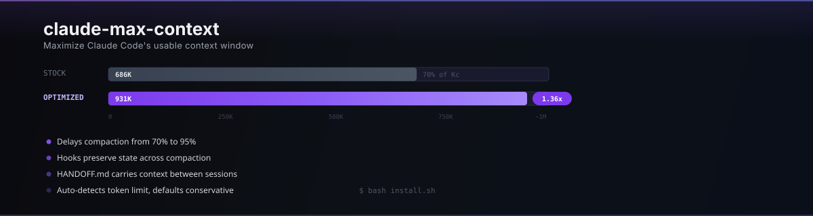

# claude-max-context

<p align="center">
  
</p>

Get more out of Claude Code's context window before it auto-compacts and forgets everything.

## The Problem

Claude Code auto-compacts at **70%** of the effective input space. On a 200K window that's **126K tokens**. On 1M it's **686K**. After compaction, it loses track of files you were editing, decisions you made, and where you left off. Start a new session and there's zero continuity from the last one.

## What This Does

Four systems working together:

**1. Delayed Compaction** — pushes auto-compact from 70% to 95% of effective input

**2. Compaction Preservation** — when compaction does fire, hooks inject a 7-point instruction list telling the compactor what to keep (files, decisions, errors, task state), and `DISABLE_PRECOMPACT_SKIP=1` forces full transcript analysis instead of speed-skipping

**3. Session Continuity** — every session loads state from the last one (HANDOFF.md, MEMORY.md, PROJECT_MAP) and saves its own state when it ends, so the next session picks up where you left off

**4. Multi-Session Mesh** — parallel Claude Code sessions detect when they're editing the same files and warn each other, preventing silent conflicts

## The Numbers

Every number below comes from Claude Code's published npm package (`@anthropic-ai/claude-code` v2.1.92). The formulas match the actual compaction logic.

```
auto_compact_at = min(Kc * pct%, Kc - 13000)
Kc              = context_window - min(output_tokens, 20000)
```

| Window | Stock compact-at | Optimized compact-at | Gain |
|--------|-----------------|---------------------|------|
| 1M | 686K | 931K | **+245K (1.36x)** |
| 200K | 126K | 169K | **+43K (1.34x)** |

The token gain is the provable part. Run `bash lib/benchmark.sh` for the full breakdown — it separates what's math, what's verified on your machine, and what needs live testing.

## Quick Start

**In Claude Code** — paste this:

```
Clone https://github.com/pkmdev-sec/claude-max-context then read AGENTS.md and follow the setup instructions. Run preflight, install, test, show me the results.
```

**Manual:**

```bash
git clone https://github.com/pkmdev-sec/claude-max-context && cd claude-max-context
bash install.sh          # detects model, picks profile, installs
bash tests/run-all.sh    # 50 checks
bash lib/benchmark.sh    # see what changed
```

Backs everything up first. Undo anytime: `bash install.sh --uninstall`.

## How It Fits Together

```
                        SESSION LIFECYCLE

    session-start.sh -------> tool use hooks -------> stop-handoff.sh
         |                          |                       |
    loads from disk:          on every call:           saves to disk:
    - HANDOFF.md              - track edits            - HANDOFF.md
    - MEMORY.md               - mesh sync              - git diff state
    - PROJECT_MAP             - enforce parallel        - last context
                                    |
                        +-----------+-----------+
                        |  AT 95% CAPACITY      |
                        |  pre-compact.sh runs   |
                        |  injects preservation  |
                        |  instructions (7-pt)   |
                        +-----------+-----------+
                                    |
                        full transcript analysis
                        (DISABLE_PRECOMPACT_SKIP=1)
                                    |
                        CLAUDE.md reloads from disk
                        (behavioral rules survive)
```

## The Hook System

Six scripts in `~/.claude/hooks/`, each fires at a specific point in the session lifecycle:

| Hook | When it fires | What it does |
|------|-------------|-------------|
| `session-start.sh` | Session opens | Loads HANDOFF.md, MEMORY.md, and PROJECT_MAP from prior sessions. Registers with mesh network. Resets edit tracker. |
| `pre-compact.sh` | Before compaction | Injects 7-point preservation list: task state, decisions, patterns found, failed approaches, file contents, working state, blockers. Tells compactor to write the summary like a handoff to a new engineer. |
| `pre-tool-use.sh` | Before each tool | Tracks which directories are being edited. If >5 edits across >3 directories, denies the edit and tells the model to use TeamCreate with parallel agents instead. Also runs project tests before allowing `git commit`. |
| `post-tool-stale.sh` | After each tool | Marks the project dependency graph as stale when files change. Checks mesh inbox for messages from other sessions. |
| `stop-handoff.sh` | Session ends | Writes HANDOFF.md with: last assistant message, git branch, modified files, diff stats. Deregisters from mesh. |
| `_lib.sh` | (shared) | Pure-bash JSON field extraction at ~0.01ms per call — hooks can't afford python3's 80ms cold start on every tool invocation. |

## The Mesh System

When you run multiple Claude Code sessions in parallel (different terminals, different projects), they can silently step on each other's files. Mesh prevents that.

```
    PERSISTED ON DISK

    ~/.claude/mesh/
    +-- registry/sessions.json    who's active (name, pid, cwd)
    +-- channels/
        +-- <session-name>/
        |   +-- inbox.jsonl       messages TO this session
        |   +-- outbox.jsonl      messages FROM this session
        |   +-- status.json       what this session is doing
        +-- global.jsonl          all activity (append-only)
```

**How it works:**

- On session start, `mesh-session-start.sh` registers with a random name (e.g. `calm-lynx`), garbage-collects dead sessions, and shows active peers
- On every file edit, `mesh-post-tool.sh` broadcasts the edit and checks if any other session recently touched the same file — if so, injects a conflict warning into context
- On session end, `mesh-stop.sh` deregisters (only if no other process took over the name)
- All IPC uses filesystem JSONL with atomic append — no daemon, no server, no blocking. Reads use cursor-based polling so you only see new messages.

**Manual mesh commands** (run from any session):

```bash
bash ~/.claude/mesh/bin/mesh-discover.sh          # list active sessions
bash ~/.claude/mesh/bin/mesh-send.sh <peer> <msg>  # send a message
```

## Session Continuity

The handoff cycle is what makes sessions feel continuous instead of starting cold:

```
    Session A ends
         |
    stop-handoff.sh writes:
         |
    ~/.claude/projects/<project>/HANDOFF.md
    +-- timestamp, session ID, git branch
    +-- last 2000 chars of assistant context
    +-- git diff stat
    +-- list of modified files
         |
    Session B starts (same project dir)
         |
    session-start.sh loads HANDOFF.md
    and injects it as additionalContext
         |
    "Continue from where the last session left off."
```

Per-project MEMORY.md works the same way but is long-lived — Claude Code writes architectural decisions and patterns there, and they persist across all future sessions in that project.

## Token Fallback

```
    Your model setting          Profile selected
    --------------------        --------------------------
    opus[1m]              --->  1m:           95%, +245K
    opus / sonnet         --->  200k:         92%, +43K
    unknown               --->  conservative: 85%, safe

    Always defaults conservative. Scales up only when confirmed.
```

Override: `--profile 1m` or `CLAUDE_CONTEXT_WINDOW=500000`.

The three profiles live in `config/profiles/` as JSON files. Each defines: context window, compact percentage, output token reserve, blocking limit, and model name. The installer reads these to generate `settings.json`.

## What Gets Installed

All in `~/.claude/` — nothing touches your projects.

| Component | Files | Purpose |
|-----------|-------|---------|
| `settings.json` | 1 | Env vars (compaction thresholds) + hook wiring |
| `CLAUDE.md` | 1 | Behavioral rules that survive compaction |
| `env-setup.sh` | 1 | Shell exports, sourced from your profile |
| `hooks/` | 6 | Session lifecycle scripts (see table above) |
| `mesh/lib/` | 2 | Core IPC library + name generation |
| `mesh/hooks/` | 3 | Auto-register, post-tool broadcast, stop deregister |
| `mesh/bin/` | 5 | Manual commands: discover, send, register, deregister, gc |

## What This Doesn't Do

- **Compaction is still lossy.** Hooks improve what gets kept — they don't eliminate loss.
- **Output quality is subjective.** Deep reasoning mode is enabled, not guaranteed.
- **Cost savings aren't measured.** Prompt caching is on; Anthropic says ~90% on hits.

## Uninstall

```bash
bash install.sh --uninstall   # originals in ~/.claude/backups/
```

## Methodology

Formulas sourced from `@anthropic-ai/claude-code` v2.1.92 npm package. The compaction logic uses internal constants and functions that determine when auto-compaction fires and where the blocking limit sits.

MIT License.
